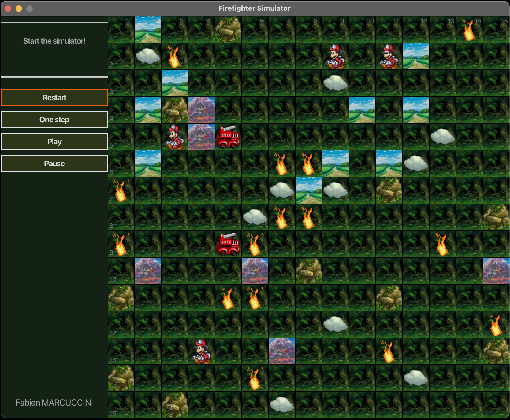
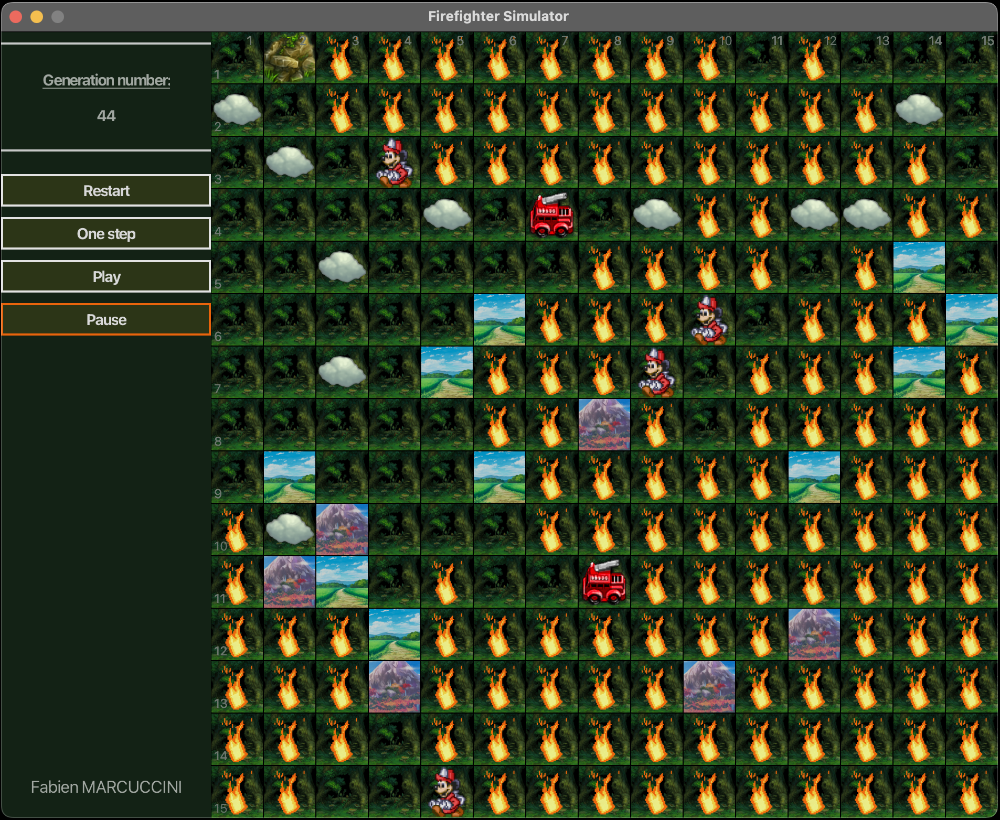
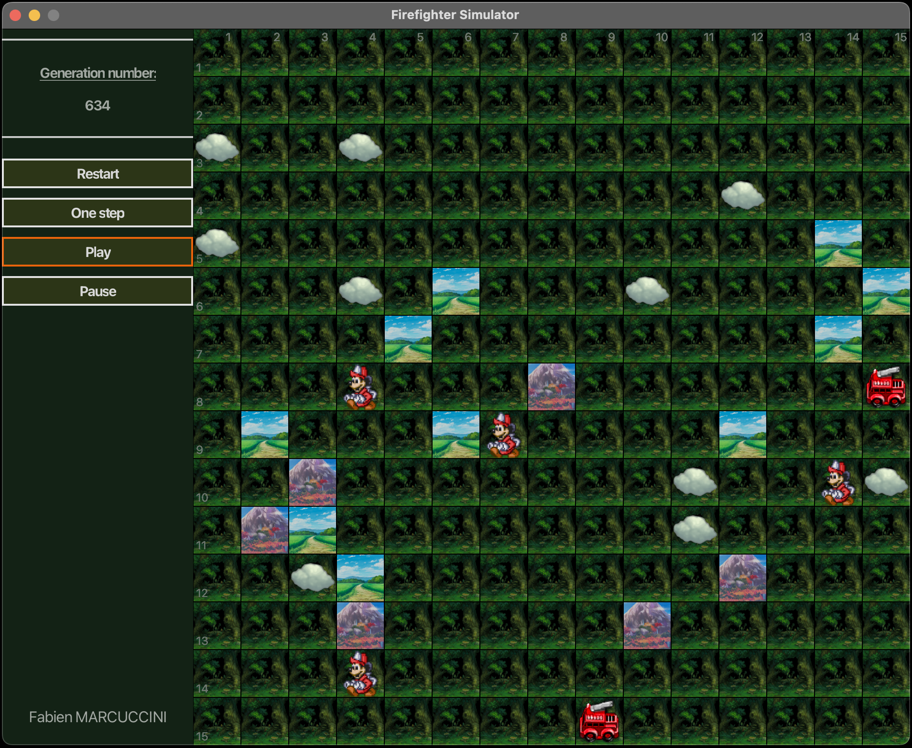

# Firefighter Simulator Application

## Technical Details
SDK: Amazon Corretto 21.0.5 - aarch64  
Gradle Version: 8.11.1

## Simulator Overview
<video width="800" controls>
  <source src="_readme-support/simulator-vid.mp4" type="video/mp4">
  Your browser does not support the video tag.
</video>

